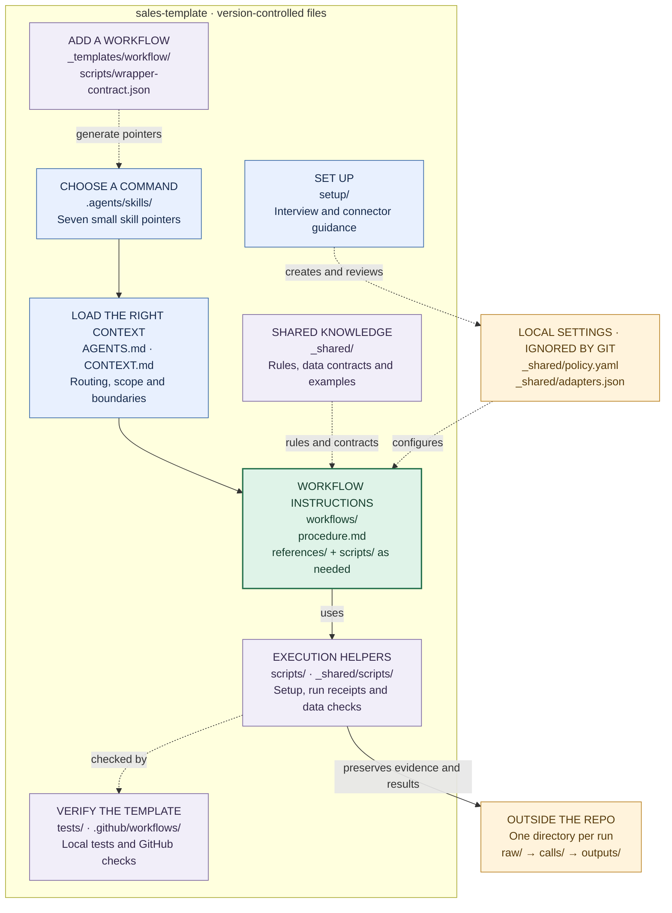

# sales-template

Seven reusable sales workflows for **Codex**: prepare for calls, log meeting
outcomes, review tasks and pipeline, forecast, report pilot usage, and close signed
deals. The agent gathers evidence, explains gaps and presents exact changes for
review. Email drafts remain unsent. Every external effect requires its own
applicable approval and independent verification.

Bring your company's sales process and connect the systems you actually use.
The template includes neutral examples and logical data contracts, with no company
pricing, product claims, private service endpoints or required CRM vendor. Setup
maps your native records, stages, fields, fiscal calendar and available tools.
It does not install integrations or claim compatibility before those mappings work.

| Choose in the `/` skill menu | What it does |
|---|---|
| sales-call-prep | Prepare a read-only account and meeting brief |
| interaction-sync | Propose CRM changes and an unsent draft after one call |
| task-triage-speed-run | Review due, overdue and undated sales tasks |
| pipeline-review | Find stale records and propose evidence-backed corrections |
| forecast-weekly | Review forecast buckets and calculate a path to target |
| pilot-usage | Analyze configured usage data or supplied exports; prepare a report/PDF |
| close | Review signed terms, won-state changes and configured downstream steps |

Each small SKILL.md points to one procedure. Open the repository as a Codex project,
type `/` and select a skill, or explicitly invoke `$sales-call-prep`, for example.

## Start here

```sh
python3.12 -m venv .venv
.venv/bin/python -m pip install -r requirements.txt
.venv/bin/python scripts/setup.py init
.venv/bin/python scripts/check_repo.py
.venv/bin/python -m unittest discover -s tests -v
```

Then ask: **“Set up this sales workspace for the workflows I use.”** The
[setup interview](setup/CONTEXT.md) collects only missing answers and writes private
settings, preserving existing configuration. [Installation](setup/installation.md)
covers runtime, skill discovery, optional PDF support and clean exports.

```sh
.venv/bin/python scripts/setup.py doctor --workflow sales-call-prep
.venv/bin/python scripts/run.py init sales-call-prep
```

Doctor reports missing configuration. Verify actual tool availability and access in
the current chat before live use. The run command prints a unique external directory
for raw evidence, normalized receipts and outputs. No customer data belongs here.
[Adapter contracts](setup/adapters.md) explain field mapping, scope and pagination.

## Repository map

The center of the repo is `workflows/`: each skill opens one procedure, which uses
shared rules and helpers. Solid arrows show the route through a workflow; dotted
arrows show configuration, shared dependencies and maintenance.



**Navigate:** [Setup](setup/CONTEXT.md) · [Skills](.agents/skills/) ·
[Workflows](workflows/) · [Shared rules](_shared/rules.md) ·
[Helpers](_shared/scripts/README.md) · [Validation](VALIDATION.md)

The two gold boxes are not published template content. Local settings stay inside
`_shared/` but are ignored by Git; customer evidence and reports stay outside the
repo. Credentials remain in your connector or credential manager.

To add a workflow, start from [_templates/workflow/](_templates/workflow/), register
it in [scripts/wrapper-contract.json](scripts/wrapper-contract.json), then run
`python scripts/wrappers.py` to generate its skill pointer.

## What is configurable

Company/product identity, seller, timezone, internal domains, writing voice, stages,
required fields, cadence, fiscal quarters, currency, targets and native mappings.
Pilot units and activity grain come from your source; no billing conversion is
assumed. Branding uses system fonts and configurable labels/colors. Close handoffs
and provisioning are optional and disabled until explicitly configured and approved.
Schedules are inert until requested through Codex.

Tests use fictional data and check local mechanics. They cannot prove live access,
source authenticity, buyer intent, human approval, message delivery or provisioning
success. Unsupported required mappings remain gaps. See [validation](VALIDATION.md)
and [provenance](PROVENANCE.md) for scope and limits.
